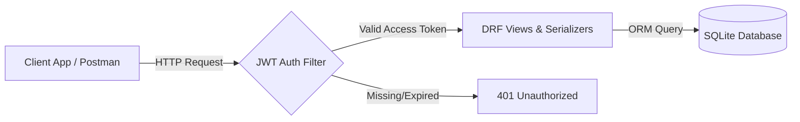

# Finance Backend REST API 💰

[](https://www.djangoproject.com/)
[](https://www.django-rest-framework.org/)
[](https://django-rest-framework-simplejwt.readthedocs.io/en/latest/)
[](https://sqlite.org/)

A secure, RESTful backend API for managing personal financial records built using **Django** and **Django REST Framework (DRF)**. It supports full CRUD operations, pagination, data validation, Django Administration, and secure JWT authentication.

---

## 🛠️ System Overview



---

## 🔐 Authentication (SimpleJWT)

This API uses JSON Web Tokens (JWT) for secure authentication.

### 1. Retrieve Access & Refresh Tokens
* **Method**: `POST`
* **Endpoint**: `/api/token/`
* **Request Body**:
```json
{
  "username": "your_username",
  "password": "your_password"
}
```
* **Response Body**:
```json
{
  "refresh": "eyJhbGciOiJIUzI1NiIsInR5cCI6IkpXVCJ9...",
  "access": "eyJhbGciOiJIUzI1NiIsInR5cCI6IkpXVCJ9..."
}
```

### 2. Access Protected Endpoints
Add the following authorization header to all API requests:
```http
Authorization: Bearer <your_access_token>
```

### 3. Refresh Access Token
* **Method**: `POST`
* **Endpoint**: `/api/token/refresh/`
* **Request Body**:
```json
{
  "refresh": "<your_refresh_token>"
}
```

---

## 📊 API Endpoints & CRUD Schema

All endpoints below require authentication.

| Method | Endpoint | Description | Request Body Parameters |
| :--- | :--- | :--- | :--- |
| **GET** | `/api/records/` | Paginated list of records | None (Supports query parameter `?page=<number>`) |
| **POST** | `/api/records/` | Create a new record | `amount` (float), `type` (string: income/expense), `category` (string), `date` (YYYY-MM-DD), `notes` (string, optional) |
| **GET** | `/api/records/<id>/` | Fetch details of a specific record | None |
| **PUT** | `/api/records/<id>/` | Update record parameters | Same as POST (requires all fields) |
| **PATCH** | `/api/records/<id>/` | Partial parameter update | Any subset of POST parameters |
| **DELETE** | `/api/records/<id>/` | Delete record | None |

### Sample Record Body (JSON)
```json
{
  "amount": 1250.75,
  "type": "expense",
  "category": "Subscriptions",
  "date": "2026-08-13",
  "notes": "Premium cloud subscription"
}
```

---

## ⚙️ Setup and Local Run

### 1. Clone the Repository
```bash
git clone https://github.com/Venkatsai20032/finance-backend.git
cd finance-backend
```

### 2. Configure Virtual Environment
Create and activate a Python virtual environment:
```bash
# Windows
python -m venv venv
venv\Scripts\activate

# macOS / Linux
python3 -m venv venv
source venv/bin/activate
```

### 3. Install Dependencies
```bash
pip install -r requirements.txt
```

### 4. Database Setup & Migrations
Perform database migrations to set up the SQLite schema:
```bash
python manage.py migrate
```

### 5. Create Administrative Superuser
```bash
python manage.py createsuperuser
```

### 6. Start the Server
```bash
python manage.py runserver
```
The API will be available locally at `http://127.0.0.1:8000/`. You can access the Django admin dashboard at `http://127.0.0.1:8000/admin/`.

---

## 📂 Project Architecture

* `finance_project/` - Application core and global configuration (routing, SimpleJWT settings).
* `finance/` - API app containing models (`Record`, `UserProfile`), serializers, endpoints, and validation logic.
* `manage.py` - Django CLI helper script.
